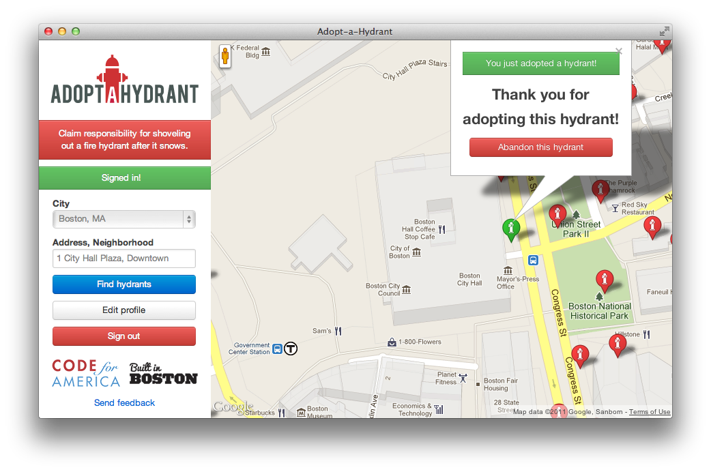

# Adopt-a-Tree

[](https://travis-ci.org/ballPointPenguin/adopt-a-tree)
[][code-climate]

[travis]: https://travis-ci.org/ballPointPenguin/adopt-a-tree
[code-climate]: https://codeclimate.com/github/ballPointPenguin/adopt-a-tree

Beautify your street by watering a tree.

## Screenshot


## See It Online
A version is deployed online at <http://stormy-tundra-2903.herokuapp.com/>

## Installation
This application requires [Postgres](http://www.postgresql.org/) to be installed

Refer to the [Adopt-a-Tree Wiki](https://github.com/codeforamerica/adopt-a-hydrant/wiki/Adopta-Install-Notes) for detailed instructions on installation.

    git clone git://github.com/ballPointPenguin/adopt-a-tree.git
    cd adopt-a-tree
    bundle install

    bundle exec rake db:create
    bundle exec rake db:schema:load

## Usage
    rails server

## Seed Data
    bundle exec rake db:seed

## Accessing Admin View

*Based on [Raleigh's Adopt-A-Hydrant installation notes](http://localwiki.net/raleigh/Adopta_App/Development?&docuredirected_from=raleigh%20adopta%20app/development).*

1. First, signup through the site. 
2. Then open a terminal and start the rails console - `rails console`.
3. List all users - `User.all`
4. Find your user id in the list. For this example, assume it is '1'.
5. Search for your user - `a=User.find(1)`
6. Set the admin flag on your user - `a.admin = true`
7. Save your user - `a.save`
8. Go back to your browser, and visit localhost:3000/admin

## Deploying to Heroku
A successful deployment to Heroku requires a few setup steps:

1. Generate a new secret token:

    ```
    rake secret
    ```

2. Set the token on Heroku:

    ```
    heroku config:set SECRET_TOKEN=the_token_you_generated
    ```

3. [Precompile your assets](https://devcenter.heroku.com/articles/rails3x-asset-pipeline-cedar)

    ```
    RAILS_ENV=production bundle exec rake assets:precompile

    git add public/assets

    git commit -m "vendor compiled assets"
    ```

4. Add a production database to config/database.yml

5. Seed the production db:

    `heroku run bundle exec rake db:seed`

Keep in mind that the Heroku free Postgres plan only allows up to 10,000 rows,
so if your city has more than 10,000 fire hydrants (or other thing to be
adopted), you will need to upgrade to the $9/month plan.

### Google Analytics
If you have a Google Analytics account you want to use to track visits to your
deployment of this app, just set your ID and your domain name as environment
variables:

    heroku config:set GOOGLE_ANALYTICS_ID=your_id
    heroku config:set GOOGLE_ANALYTICS_DOMAIN=your_domain_name

An example ID is `UA-12345678-9`, and an example domain is `adoptahydrant.org`.

## Contributing
In the spirit of [free software][free-sw], **everyone** is encouraged to help
improve this project.

[free-sw]: http://www.fsf.org/licensing/essays/free-sw.html

Here are some ways *you* can contribute:

* by using alpha, beta, and prerelease versions
* by reporting bugs
* by suggesting new features
* by [translating to a new language][locales]
* by writing or editing documentation
* by writing specifications
* by writing code (**no patch is too small**: fix typos, add comments, clean up
  inconsistent whitespace)
* by forking and sending pull requests
* by refactoring code
* by closing [issues][]
* by reviewing patches
* [financially][]

[locales]: https://github.com/codeforamerica/adopt-a-hydrant/tree/master/config/locales
[issues]: https://github.com/ballPointPenguin/adopt-a-tree/issues
[financially]: https://secure.codeforamerica.org/page/contribute

## Submitting an Issue
We use the [GitHub issue tracker][issues] to track bugs and features. Before
submitting a bug report or feature request, check to make sure it hasn't
already been submitted. When submitting a bug report, please include a [Gist][]
that includes a stack trace and any details that may be necessary to reproduce
the bug, including your gem version, Ruby version, and operating system.
Ideally, a bug report should include a pull request with failing specs.

[gist]: https://gist.github.com/

## Submitting a Pull Request
1. [Fork the repository.][fork]
2. [Create a topic branch.][branch]
3. Add specs for your unimplemented feature or bug fix.
4. Run `bundle exec rake test`. If your specs pass, return to step 3.
5. Implement your feature or bug fix.
6. Run `bundle exec rake test`. If your specs fail, return to step 5.
7. Run `open coverage/index.html`. If your changes are not completely covered
   by your tests, return to step 3.
8. Add, commit, and push your changes.
9. [Submit a pull request.][pr]

[fork]: http://help.github.com/fork-a-repo/
[branch]: http://learn.github.com/p/branching.html
[pr]: http://help.github.com/send-pull-requests/

## Supported Ruby Version
This library aims to support and is [tested against][travis] Ruby version 2.1.0.

If something doesn't work on this version, it should be considered a bug.

This library may inadvertently work (or seem to work) on other Ruby
implementations, however support will only be provided for the version above.

If you would like this library to support another Ruby version, you may
volunteer to be a maintainer. Being a maintainer entails making sure all tests
run and pass on that implementation. When something breaks on your
implementation, you will be personally responsible for providing patches in a
timely fashion. If critical issues for a particular implementation exist at the
time of a major release, support for that Ruby version may be dropped.

## Copyright
Copyright (c) 2014 Code for America. See [LICENSE][] for details.

[license]: https://github.com/codeforamerica/adopt-a-hydrant/blob/master/LICENSE.md

[][tracker]

[tracker]: http://stats.codeforamerica.org/projects/adopt-a-hydrant
